# RoboRoute Nexus

RoboRoute Nexus is a last-mile control tower: a low-poly 3D city, a bounded vehicle-routing solver, a live fleet simulation, road-closure interventions, and a local AI copilot that explains the current operation.

The project is deliberately self-contained. The browser renders a fictional road graph with Three.js; FastAPI owns scenario state and optimisation; OR-Tools produces the plan; Ollama runs `qwen3:4b` locally when the operator asks for it.

[Open the project site](https://pepoychris.github.io/vrp-ai-playground/) · [Read the contracts](docs/contracts/README.md)

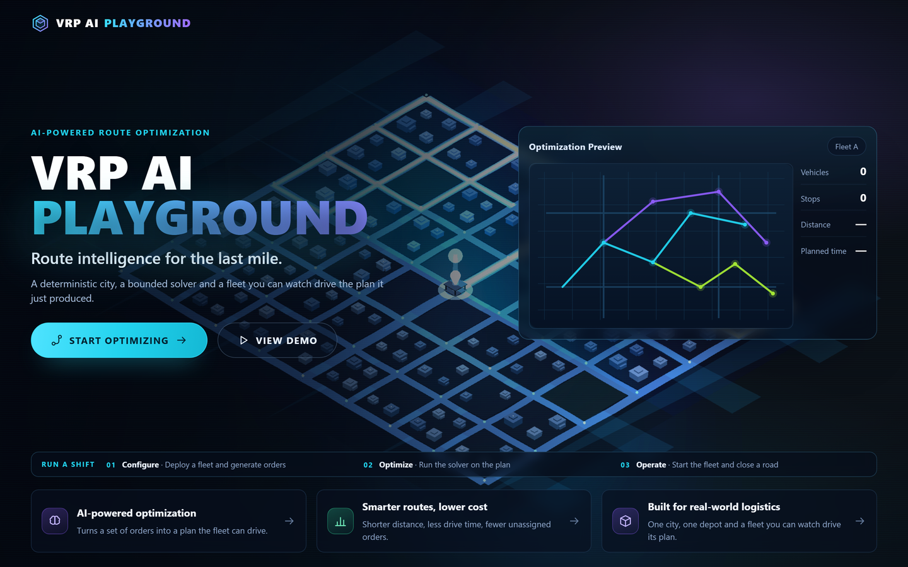

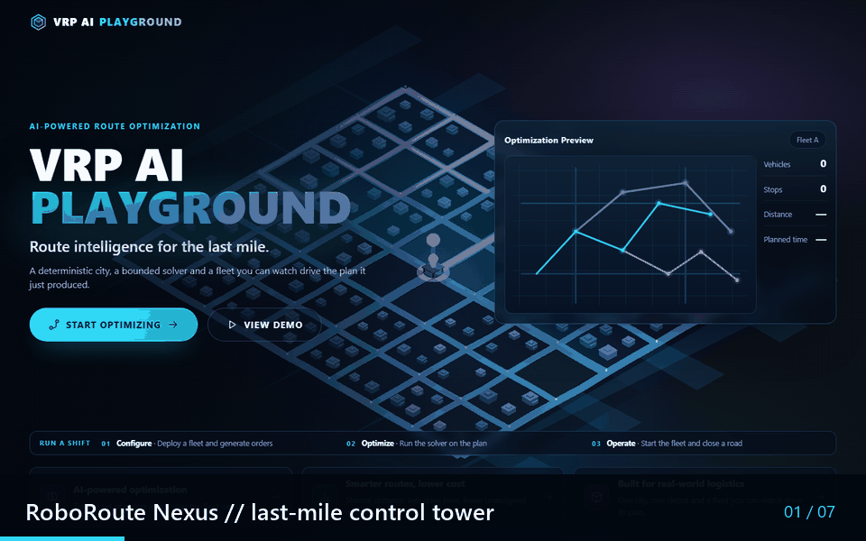

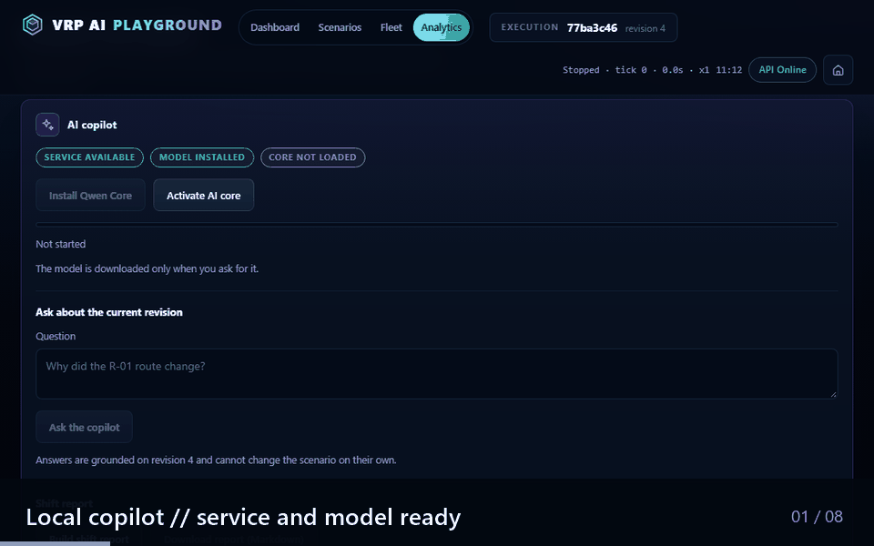

## What you can do

- Generate a fresh fleet and delivery orders from the control deck.
- Optimise routes with capacity, time-window, duration and cost constraints.
- Watch robots move through the 3D city and pause/resume the simulation clock.
- Grab a robot with the claw gesture or close a road with a robotic barrier.
- Compare the before/after plan after an intervention.
- Ask a grounded local copilot about the visible scenario.
- Build and download a Markdown shift report. AI proposals never mutate the scenario without human confirmation.

## Product surfaces

| Landing | Live city |
| --- | --- |
|  | 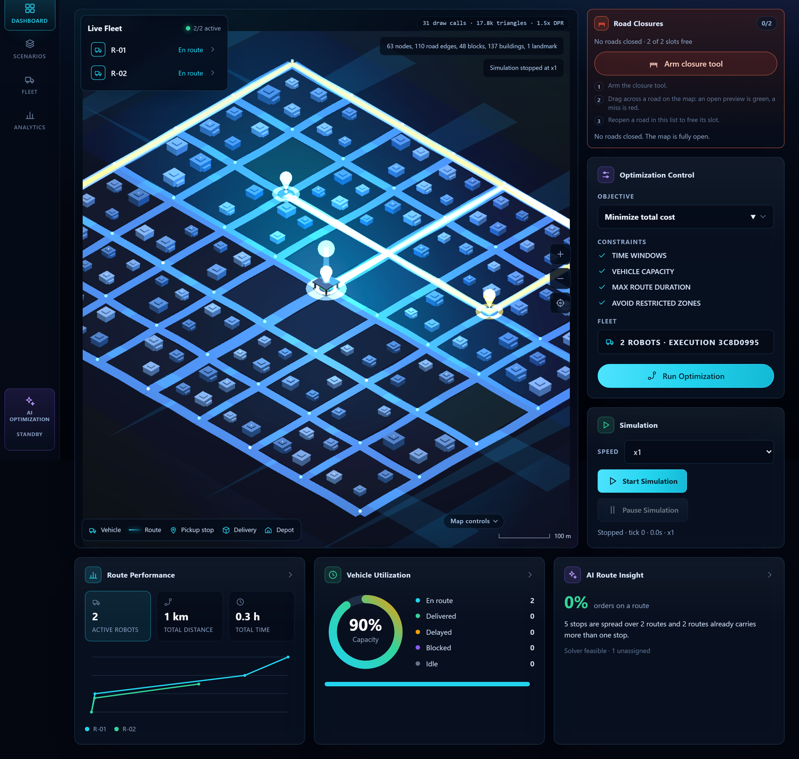 |

| Road closure | Reopened road |
| --- | --- |
| 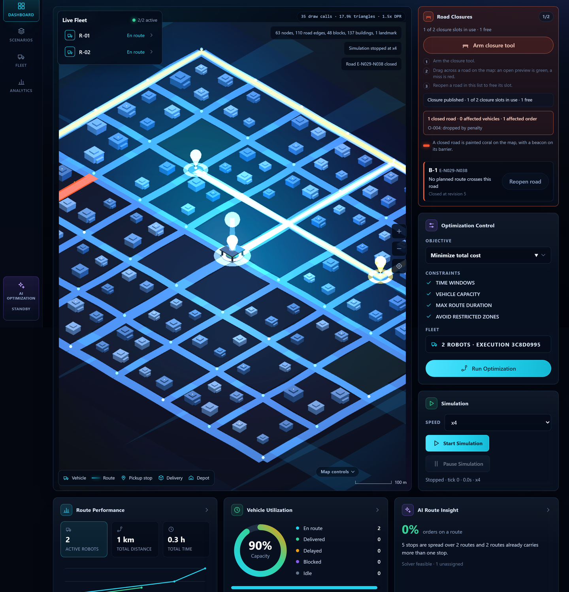 | 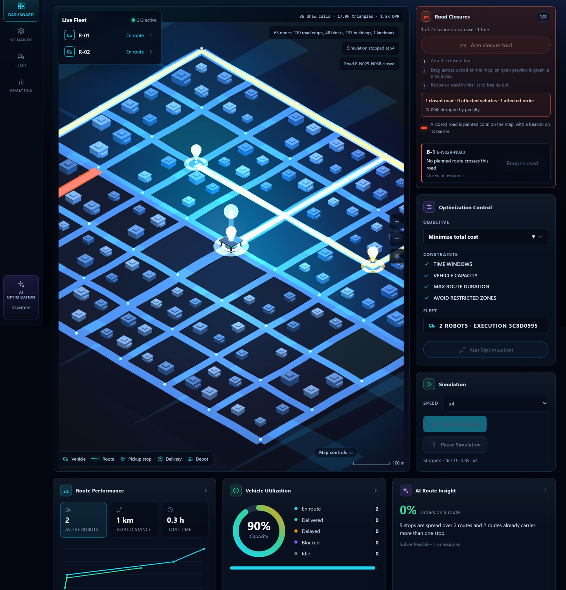 |

| Running clock | Scenario builder |
| --- | --- |
| 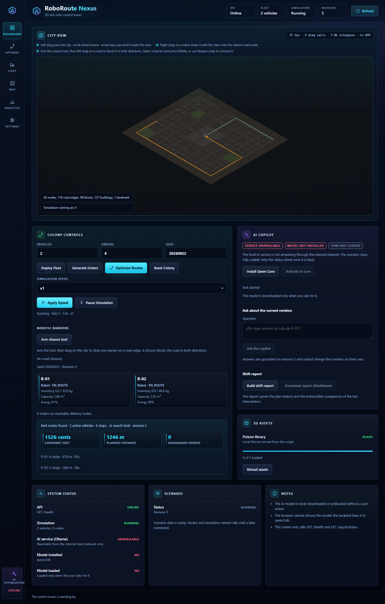 | 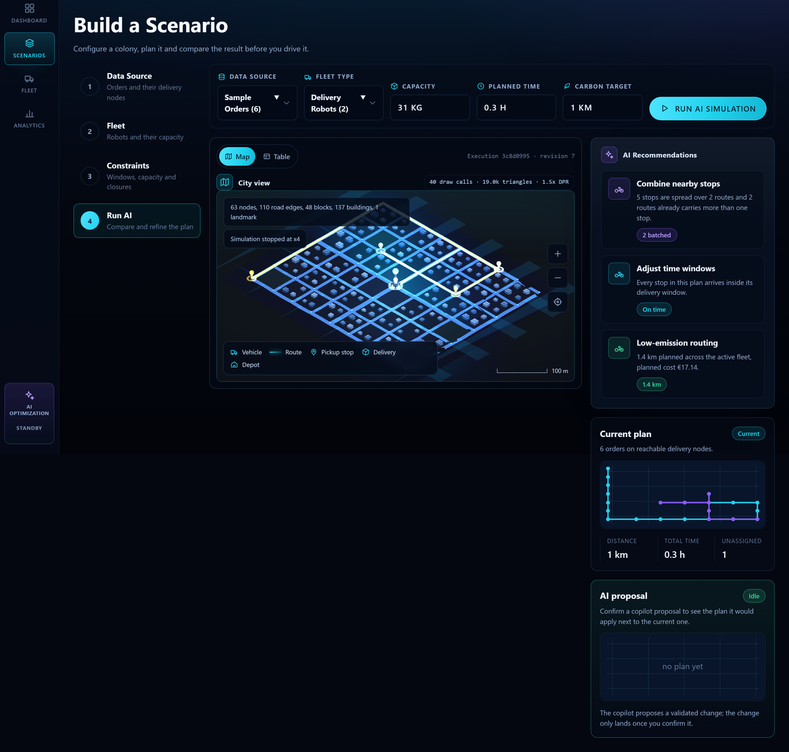 |

## Architecture

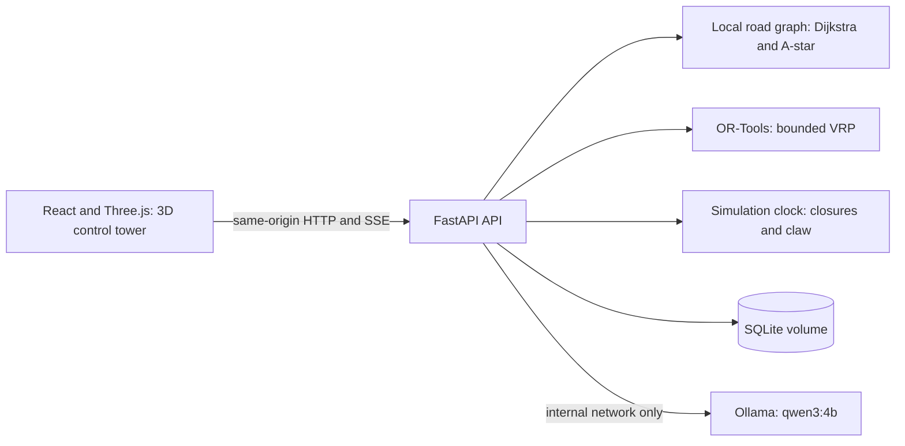

### The operator loop

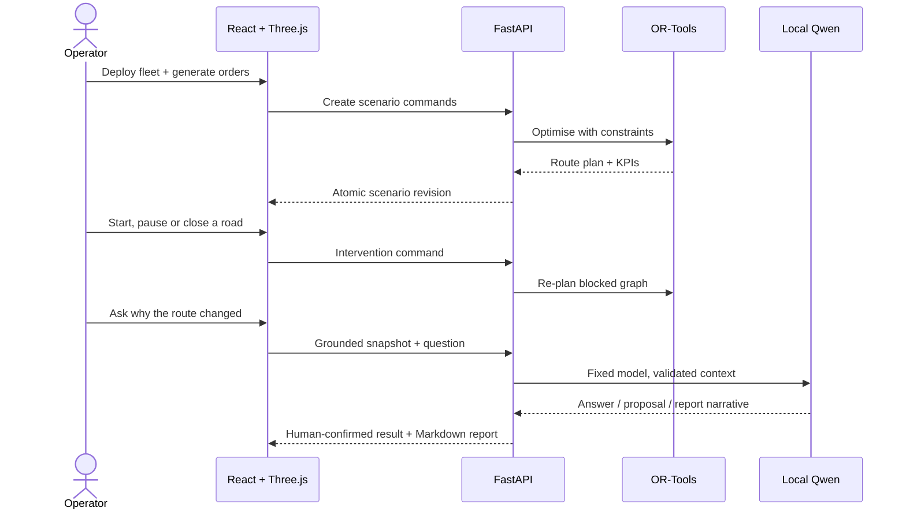

| Layer | Technology |
| --- | --- |
| Frontend | React 19, TypeScript, Vite, Three.js 0.186 |
| Backend | Python, FastAPI, Pydantic |
| Optimisation | Google OR-Tools |
| Local AI | Ollama 0.34.2, fixed `qwen3:4b` model |
| Runtime | Docker Compose, persistent SQLite and model volumes |
| Verification | Vitest, Python unittest, Playwright |

## Quick start (Docker)

Requirements: Docker Desktop with Compose v2 and a browser. The first AI install also needs Internet access to download the model.

```bash
git clone https://github.com/pepoychris/vrp-ai-playground.git
cd vrp-ai-playground
docker compose up --build
```

Open [http://localhost:8080](http://localhost:8080). The API health endpoint is [http://localhost:8000/health](http://localhost:8000/health).

The stack starts idle by design. In the browser, follow this order:

1. **Start Optimizing** to enter the control deck.
2. Open **Fleet**, choose the vehicle count and press **Deploy Fleet**.
3. Choose the order count and press **Generate Orders**.
4. Press **Optimize Routes**, then **Start Simulation**.
5. Use the claw gesture or arm the closure tool and drag over a road.
6. Re-open the copilot from **Analytics**, install/activate the AI core if needed, ask a question and build the shift report.

Stop the stack with `Ctrl+C`, or run `docker compose down`. Named volumes keep SQLite and the model between runs; remove them explicitly only when you want a clean reset.

## Local development without Docker

Backend (PowerShell):

```powershell
\.venv\Scripts\python.exe -m pip install -r api/requirements-dev.txt
\.venv\Scripts\python.exe -m uvicorn api.app.main:app --reload --port 8000
```

Frontend (a second terminal):

```powershell
cd frontend
npm ci
npm run dev
```

Vite serves the UI at [http://localhost:5173](http://localhost:5173) and proxies `/health` and `/api` to port 8000.

## Local AI flow

The backend fixes the model name and inference policy. The browser cannot select an arbitrary model and never talks to Ollama directly.

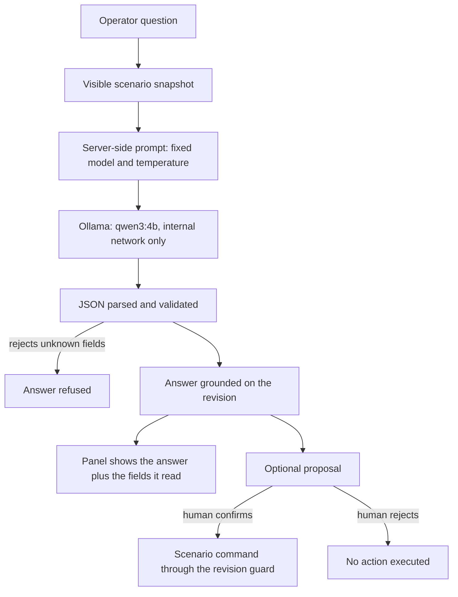

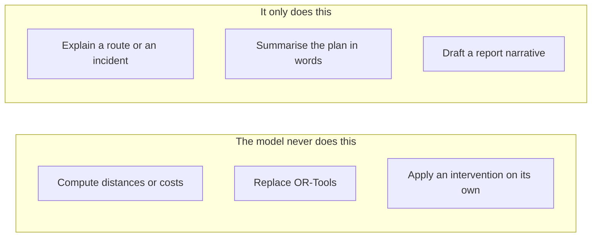

1. **Install Qwen Core** starts the on-demand pull and streams progress through `/api/ai/model/install/events`.
2. **Activate AI core** preloads `qwen3:4b` with the approved context and temperature settings.
3. **Ask the copilot** sends the visible scenario snapshot plus the question. The answer is validated and tagged with the revision it used.
4. **Build shift report** combines deterministic metrics with an AI narrative. **Download report (Markdown)** exports the report for sharing.

The model explains routes and incidents; it does not calculate distances, replace OR-Tools, or apply an action without confirmation. Ollama is reachable only inside the Compose network and cloud features are disabled.

## Documentation map

- [Project site and demos](https://pepoychris.github.io/vrp-ai-playground/) — visual overview, exact run guide and two GIF walkthroughs.
- [API and data contracts](docs/contracts/README.md) — REST/SSE endpoints, schemas and examples.
- [Frontend runbooks](frontend/docs/) — city, routing, simulation, barriers, AI and verification notes.
- [Visual identity](frontend/docs/visual-identity.md) — palette, typography, lighting and asset budgets.

Both GIFs are real captures of the running stack, not mock-ups. The pipeline lives in
[`tools/demos`](tools/demos/README.md):

```powershell
# with the stack up (docker compose up) and the frontend built
node tools/demos/capture_execution.mjs    # deck: deploy, optimise, run, close, reopen
node tools/demos/capture_copilot.mjs      # copilot: activate, ask, answer, report
\.venv\Scripts\python.exe tools/demos/build_gifs.py
```

The capture frames are transient; only the composed GIFs and the derived landing hero are
committed.

## Verification

```powershell
\.venv\Scripts\python.exe -m unittest discover -s api/tests -t .
python spike/fase0/tools/validate_contracts.py
cd frontend
npm run build
npm test
npm run test:e2e
```

The E2E suite covers the landing page, deck navigation, route optimisation, a running clock, road closures/reopening and responsive layouts. It also records the screenshots used by the project site.

## Scope and limitations

This is an offline-first demonstration, not a production dispatch system. It has no authentication, multi-user permissions, GPS, geocoding, live traffic/weather, mobile client, RAG/vector store or public Ollama endpoint. Fixture assets are procedural stand-ins and can be replaced while keeping the asset contract and render budgets green.

## License and contributions

This repository is maintained as a portfolio project. Issues and pull requests are welcome; keep API contracts and the local-only AI boundary intact when proposing changes.
